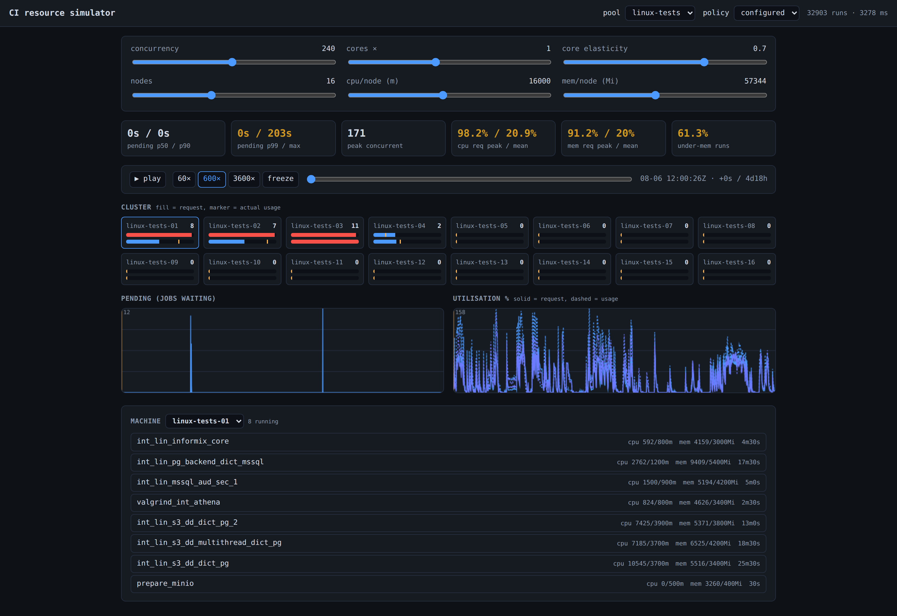

# 4. Проектная часть выпускной квалификационной работы

## 4.1. Тема и аппарат исследования

> **Тема.** Метод обоснованного назначения ресурсных запросов задачам конвейера
> непрерывной интеграции на основе квантильного прогнозирования потребления и
> имитационного моделирования пула исполнителей.

Формулировка выражает проблематику, а не результат: в ней зафиксировано, что
назначение запросов сегодня не является обоснованным, и что обоснованность
достигается соединением двух методов, которые в литературе применяются порознь.

**Объект исследования** — процессы управления вычислительными ресурсами
конвейеров непрерывной интеграции, исполняемых в кластерах контейнерной
оркестрации. Рассматриваются конвейеры, задачи которых выполняются как конечные
контейнеризованные процессы при фиксированной ёмкости пула исполнителей.

**Предмет исследования** — модели и методы прогнозирования ресурсного
потребления задач конвейера и оценки конфигураций ресурсных запросов посредством
имитационного моделирования пула исполнителей.

**Гипотеза.** Замена статической перцентильной эвристики моделью квантильной
регрессии, обученной на признаках, известных до запуска задачи, при раздельном
выборе квантилей для памяти и процессора, позволяет одновременно снизить долю
недооценённых по памяти прогонов и долю непроизводительно зарезервированной
ёмкости; при этом имитационная модель пула позволяет до внедрения определить
область значений степени параллелизма, в которой конфигурация сохраняет
устойчивость. Гипотеза фальсифицируема: она опровергается, если на отложенной во
времени выборке модель не превосходит эвристику одновременно по обоим
показателям, либо если прогноз имитационной модели систематически расходится с
фактическим поведением пула.

**Цель работы** — разработать и экспериментально обосновать метод назначения
ресурсных запросов задачам конвейера непрерывной интеграции, обеспечивающий
управляемый компромисс между надёжностью выполнения, временем ожидания задач и
утилизацией ёмкости пула, и подтвердить его применимость на данных промышленного
конвейера.

**Материалы и методы.** Эмпирической базой служит ретроспективная телеметрия
промышленного конвейера: периодические срезы, накапливаемые в объектном
хранилище без удаления. На один прогон наблюдаются среднее и сглаженное по
выбросам высокое потребление процессора и памяти, необработанный пик, время
ожидания планирования, временны́е границы выполнения и значение запроса,
заданное на момент прогона. Целевой переменной выступает сглаженный высокий
уровень потребления, а не необработанный пик: кратковременный выброс допустим по
построению, тогда как устойчивое превышение ведёт к вытеснению.

Срезы формируются с перекрытием, вследствие чего один прогон попадает в
несколько срезов; без дедупликации по идентификатору прогона обучающая и
контрольная выборки пересекаются, а оценка качества оказывается завышенной. Все
признаки, производные от истории задачи, вычисляются со сдвигом, исключающим
использование прогоном собственного значения.

Прогнозирование выполняется квантильной регрессией на градиентном бустинге
деревьев. Выбор обоснован тем, что предсказывается заданный перцентиль
распределения, а не среднее, что непосредственно соответствует смыслу ресурсного
запроса; метод штатно обрабатывает пропуски, неизбежные для задач без истории;
обучение выполняется за секунды на процессоре. Состоятельность выбора для
данного класса задач подтверждается работой [6].

Имитационное моделирование выполняется дискретно-событийно: каждый исторический
прогон отображается в задачу, поступающую в момент фактической подачи,
исполняющуюся в течение фактической длительности и потребляющую фактический
высокий уровень ресурсов. Планировщик резервирует ёмкость **по запросу**, как
это делает планировщик Kubernetes, тогда как фактическое потребление учитывается
отдельно — именно это делает наблюдаемым переподписание ёмкости.

**Научная новизна** состоит в модели потока задач конвейера для имитационного
моделирования, учитывающей конечность и неоднородность задач, коррелированное
поступление и ограничение потребления процессора числом ядер (П1); формализации
асимметрии невытесняемого и вытесняемого ресурсов в виде раздельных целевых
функций (П4); установлении условий трансляции улучшения метрик прогноза в
улучшение системных показателей пула (П2); воспроизводимой методике оценки
конфигурации на собственной телеметрии организации (П3) и замкнутом контуре её
сопровождения (П5).

**Практическая значимость.** При наблюдаемом в отрасли уровне утилизации памяти
около 20 % [11] потенциал сокращения непроизводительного резервирования
существен и непосредственно конвертируется в пропускную способность пула.
Управляемая вероятность недооценки памяти снижает число аварийных завершений, не
связанных с дефектами кода, и тем самым сохраняет доверие к сигналу конвейера
[1], [2]. Имитационная модель позволяет отвечать на вопросы планирования ёмкости
до закупки оборудования. Метод реализуется целиком на открытом стеке и не
требует передачи телеметрии внешним службам.

## 4.2. Задачи выпускной квалификационной работы

Таблица 5. Декомпозиция цели на исследовательские задачи

| № | Задача | Закрывает | Состояние |
|---|---|---|---|
| 1 | Формирование и валидация эмпирической базы: состав телеметрии, устранение смещения выборки, разведочный анализ | П3 частично | выполнена частично |
| 2 | Формализация критериев качества конфигурации и раздельных целевых функций для двух ресурсов | П4 | выполнена частично |
| 3 | Разработка и верификация имитационной модели пула исполнителей | П1 | прототип; верификация предстоит |
| 4 | Разработка прогнозной модели потребления и её сравнение с базовой линией | П2 частично | первая версия |
| 5 | Исследование связи прогноза и системных показателей; факторный эксперимент | П2 | не начата |
| 6 | Разработка методики применения и опытная эксплуатация | П3 | не начата |
| 7 | Построение контура непрерывного сопровождения конфигурации | П5 | не начата |

Задачи 1–4 обеспечивают инструментальную готовность, задача 5 образует основной
научный результат по существу метода, задачи 6 и 7 переводят его в форму,
пригодную к эксплуатации. Задача 7 не является дополнительной: объект
нестационарен, вследствие чего результаты задач 4 и 5, взятые сами по себе,
устаревают с момента получения.

## 4.3. Методология непрерывного сопровождения конфигурации

### 4.3.1. Нестационарность объекта управления

Ресурсный профиль конвейера не является характеристикой стабильного
физического процесса. Это характеристика **кодовой базы, находящейся в
ежедневном изменении**, и инфраструктуры, изменяющейся вслед за ней.

Таблица 6. Источники изменения ресурсного профиля

| Источник изменения | Воздействие |
|---|---|
| Исправление дефектов | Меняются пути исполнения и объём обрабатываемых в тестах данных; потребление задачи смещается без изменения её имени |
| Автоматизация и оптимизация тестов | Сокращается длительность, но нередко возрастает мгновенное потребление |
| Добавление новых функций | Появляются задачи без истории; растёт потребление существующих |
| Изменение флагов сборки и тестирования | Включение динамических анализаторов или отладочных сборок меняет потребление памяти кратно, а не на проценты |
| Включение параллельных режимов | Меняется и потребление отдельной задачи, и форма потока: усиливается коррелированность поступления, растут мгновенные пики |
| Изменение инфраструктуры | Меняется не прогнозируемая величина, а ограничение, в котором она применяется |

Эмпирическое подтверждение подвижности получено на исследуемом контуре: за 47
суток наблюдения число задач выросло примерно на 20 %. Отсюда вывод,
определяющий форму решения:

> Любая однократно обученная модель и любой однократно вычисленный набор
> запросов устаревают с момента получения. Задача не имеет решения в виде
> результата — она имеет решение только в виде **процесса**, поддерживающего
> конфигурацию в соответствии с изменяющимся объектом.

### 4.3.2. Замкнутый контур сопровождения

Предлагаемая методология организует оба компонента метода в замкнутый контур,
построенный по принципам MLOps [32], [33]. Структура контура приведена на
рисунке 1.

Рисунок 1 – Контур непрерывного сопровождения конфигурации

Контур состоит из пяти стадий. **Сбор телеметрии** ведётся непрерывно, с
накоплением в объектном хранилище без удаления, причём срез фиксирует и
фактическое потребление, и действовавшую на тот момент конфигурацию.
**Переобучение** выполняется по расписанию и по триггеру обнаруженного дрейфа на
актуальном окне истории. **Приёмочная проверка** на имитационной модели
рассматривается отдельно ниже. **Контролируемое применение** сопровождается
защитными ограничениями: теневой режим, нижняя граница по памяти, применение
только при значимом отклонении, поэтапное развёртывание по группам задач, откат
через систему контроля версий. **Наблюдение результата** сопоставляет фактические
показатели с предсказанными имитационной моделью и замыкает контур.

Триггерами внеочередного переобучения служат смещение распределения потребления
в пределах группы задач, появление задач без истории свыше порогового числа,
рост ошибки прогноза и рост доли недооценённых по памяти прогонов [34], [35],
[36]. Существенное различение: изменение инфраструктуры **не** делает модель
неверной, поскольку предсказываемое потребление задачи от числа узлов не
зависит; неверной становится ранее принятая конфигурация, и реакцией является
повторный прогон приёмочной проверки при новом описании пула, а не переобучение.

### 4.3.3. Имитационная модель как приёмочный барьер

Настоящий раздел содержит основное методологическое предложение работы.

В классическом контуре MLOps стадия приёмки оценивает **качество модели**:
значение метрики ошибки на отложенной выборке сопоставляется с пороговым [32],
[33]. Для рассматриваемой задачи такая проверка недостаточна принципиально:
метрика ошибки оценивает прогноз для отдельной задачи, тогда как последствия
определяются применением всего набора запросов к потоку при ограниченной
ёмкости, из-за чего улучшение прогноза для одних задач может вытеснить другие.

Предлагается заменить приёмочный барьер контура: вместо порога по метрике
качества модели ввести **проверку системного последствия на имитационной модели
управляемой системы**. Набор запросов допускается к применению, если для
заданного множества режимов степени параллелизма и форм пула доля недооценённых
по памяти прогонов не превосходит достигнутой действующей конфигурацией, время
ожидания в заданных перцентилях не выходит за установленную границу, а пиковая
утилизация по каждому ресурсу сохраняет заданный запас. Множество режимов
обязательно включает режимы **более напряжённые**, чем текущий: именно в них
проявляется риск, не наблюдаемый при фактической загрузке.

Методологическая новизна состоит в том, что приёмочным критерием обучаемой
модели выступает не её собственная метрика, а **поведение управляемой ею
системы, воспроизведённое имитационной моделью**.

## 4.4. Предварительный эксперимент

Эксперимент выполнен на имеющемся заделе; его цель — проверить работоспособность
связки «прогнозная модель → имитационная модель» и обоснованность приёмочного
барьера. Данные — выборка, описанная в разделе 2.3. Разделение на обучающую и
контрольную части выполнено **по времени** в отношении 70/30: около 295 тысяч
прогонов на обучение, около 126 тысяч на контроль. Сопоставляются три политики:
`configured` — запросы, фактически заданные инженерами; `heuristic` — перцентиль
потребления задачи с коэффициентом запаса; `model` — квантильная регрессия.

Таблица 7. Качество прогноза по памяти (целевой квантиль 0,95)

| Политика | Покрытие | Непроизводительный резерв | Средний запрос |
|---|---|---|---|
| `configured` | 68,3 % | 24,3 % | 3 185 Ми |
| `heuristic` | 97,2 % | 54,7 % | 7 996 Ми |
| `model` | 93,4 % | 47,3 % | 7 030 Ми |

Действующая конфигурация покрывает распределение существенно ниже безопасного
уровня: почти треть прогонов выходит за назначенный запрос. Обучаемая модель не
превосходит эвристику по обоим показателям одновременно — она уступает по
покрытию и выигрывает по резерву, занимая иную точку на кривой компромисса.
Причина видна из сопоставления с целевым квантилем: эвристика систематически
**перевыполняет** его (97,2 % при цели 95 %) за счёт коэффициента запаса, тогда
как модель приближается к нему снизу. Выбор между политиками по этим показателям
невозможен: эвристика безусловно лучше по надёжности, модель — по экономии.

Тот же поток задач воспроизведён на имитационной модели при конфигурации,
соответствующей эксплуатируемой: 16 узлов, предел параллелизма 240.

Таблица 8. Системное последствие применения политик

| Показатель | `configured` | `heuristic` |
|---|---|---|
| Средний запрос памяти | 3 254 Ми | 6 495 Ми |
| Помещается на пул одновременно | 282 задачи | 141 задача |
| Время ожидания, медиана | 0 с | 50 мин |
| Время ожидания, p90 | 0 с | 4 ч 04 мин |
| Время ожидания, p99 | 0 с | 7 ч 11 мин |
| Пиковый параллелизм | 152 из 240 | 117 из 240 |
| Недооценка по памяти | 34,2 % | 3,0 % |

Результат однозначен. Эвристика снижает недооценку по памяти более чем в
одиннадцать раз — именно то улучшение, которое предсказывают метрики прогноза, —
и одновременно **делает конвейер непригодным к эксплуатации**: медианное время
ожидания вырастает с нуля до пятидесяти минут, а девять прогонов из десяти ждут
дольше четырёх часов. Причина в первых двух строках таблицы: удвоение среднего
запроса вдвое сокращает число задач, помещающихся на пул, предел параллелизма
перестаёт быть действующим ограничением, им становится ёмкость по памяти, и
очередь растёт неограниченно. Обнаружить этот эффект по показателям таблицы 7
невозможно: они вычисляются по отдельным прогонам и не содержат сведений ни о
ёмкости пула, ни о степени параллелизма.

Состояние имитационной модели при действующей конфигурации показано на
рисунке 2: регуляторы конфигурации, показатели, сетка узлов с раздельным
отображением зарезервированного и фактически потребляемого ресурса, графики
ожидания и утилизации во времени.

Рисунок 2 – Интерфейс имитационной модели: воспроизведение потока из 392 369 прогонов при действующей конфигурации (идентификаторы задач обезличены)

**Выводы эксперимента.** Пробел П2 подтверждён экспериментально: утверждение о
том, что улучшение метрик прогноза не гарантирует улучшения поведения системы,
до сих пор выдвигалось как гипотеза на основании анализа литературы, а теперь
получило прямое подтверждение. Приёмочный барьер на имитационной модели отклонил
бы политику `heuristic` по условию о времени ожидания — до её применения к
промышленному контуру и без каких-либо отказов в эксплуатации. Гипотеза
исследования уточняется: постановка задачи как двухкритериальной оптимизации
неполна, **третьим критерием выступает достижимая степень параллелизма**, и он
способен обесценить выигрыш по первым двум. Направление доработки прогнозной
модели определено: первоочередной задачей является не повышение точности как
таковой, а **калибровка** предсказанного квантиля, поскольку именно он служит
управляющим параметром риска. Наконец, обоснована практическая осуществимость:
полный цикл выполняется за время порядка минуты на обычном процессоре, что
позволяет включить приёмочную проверку в автоматизированный контур.

## 4.5. План-график дальнейшей работы

Таблица 9. Этапы работы над диссертацией

| Этап | Задачи | Контрольная точка |
|---|---|---|
| Завершение эмпирической базы | 1, 2 | Описание выборки; базовая линия по всем показателям; переход к прямой фиксации вытеснения контейнеров |
| Верификация имитационной модели | 3 | Количественная оценка расхождения воспроизведённых и фактических показателей |
| Развитие прогнозной модели | 4 | Калибровка квантиля; расширенный набор признаков; сравнение на отложенной выборке |
| Факторный эксперимент | 5 | Карта режимов «конфигурация — системный эффект»; условия применимости |
| Методика и контур сопровождения | 6, 7 | Замкнутый контур с приёмочной проверкой и защитными механизмами; опытная эксплуатация |
| Оформление и апробация | — | Текст диссертации; публикации; предзащита |

Планируется публикация не менее двух работ: по модели потока задач конвейера и
результатам её верификации, а также по основному результату — условиям
трансляции качества прогноза в системные показатели пула.

Основные риски и меры их снижения. *Недостаточная глубина истории*: риск
подтверждён на практике — оценка по четырём суткам разошлась с оценкой по 47
суткам вдвое; накопление ведётся непрерывно и без удаления. *Расхождение
имитационной модели с реальностью*: этап верификации вынесен до основного
эксперимента именно для раннего выявления. *Отрицательный результат по
гипотезе*: реализовался частично, причина установлена — недостаточная калибровка
квантиля; при этом эксперимент дал самостоятельный результат о недостаточности
метрик прогноза. *Изменение объекта быстрее цикла исследования*: результатом
работы заявляется контур сопровождения, а не однократно вычисленная
конфигурация.

## 4.6. Апробация подхода Documentation-as-Code

Настоящий отчёт подготовлен по подходу Documentation-as-Code: его исходный текст
является артефактом репозитория системы контроля версий, а итоговые документы
формируются автоматически. Платформой выбран отечественный открытый продукт
Gramax [10], включённый в единый реестр российских программ: он хранит каталог
документации в виде файлов лёгковесной разметки в репозитории Git и позволяет
выгружать документ по заданному шаблону из командной строки.

Роль сборочного конвейера исполняют скрипты, воспроизводящие его структуру:
границы стадий, немедленная остановка при отказе, каталог артефактов. Стадии
выполняют структурную проверку исходного текста, штатную проверку каталога,
контроль требований к библиографии, растеризацию схем, сборку версии для чтения
и формирование итогового документа.

Практическая ценность подхода обнаружилась в том, что автоматические проверки
выявили класс дефектов, **невидимых в исходном тексте и проявляющихся только в
собранном документе**. К ним относятся: дублирование заголовка раздела, когда
платформа формирует его из параметра, а в теле присутствует такой же заголовок;
нарушение порядка следования разделов при совпадении их номеров; ссылка на
несуществующий номер источника, возникающая при перенумерации перечня; наконец,
случай, когда векторная схема помещалась в документ без преобразования, но под
именем растрового формата, вследствие чего текстовый процессор её не отображал.
Последний дефект существовал исключительно внутри полученного файла: все стадии
завершались успешно, и обнаружить его удалось лишь прямым разбором содержимого.

Отсюда практический вывод, имеющий значение и за пределами подготовки отчёта:
проверять следует не только исходный текст, но и **собранный артефакт** —
успешно завершившийся конвейер сам по себе не является доказательством
пригодности результата.
