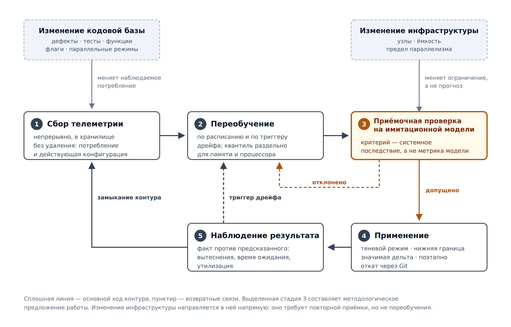

Раздел вводит методологическую рамку, в которой применяются оба компонента
метода. Необходимость такой рамки вытекает из свойства объекта, до сих пор в
отчёте не обсуждавшегося прямо, — его **нестационарности**.

## 4.4.1. Нестационарность объекта управления

Ресурсный профиль конвейера непрерывной интеграции не является характеристикой
стабильного физического процесса. Это характеристика **кодовой базы,
находящейся в ежедневном изменении**, и инфраструктуры, изменяющейся вслед за
ней. Перечислим источники изменения, наблюдаемые в промышленной эксплуатации.

| Источник изменения | Воздействие на ресурсный профиль |
|---|---|
| Исправление дефектов | Меняются пути исполнения и объём обрабатываемых в тестах данных; потребление отдельной задачи смещается без изменения её имени |
| Автоматизация и оптимизация тестов | Сокращается длительность, но нередко возрастает мгновенное потребление; соотношение «время × ресурс» перестраивается |
| Добавление новых функций | Появляются новые задачи, не имеющие истории (холодный старт), и растёт потребление существующих |
| Изменение флагов сборки и тестирования | Переход на иной режим компиляции, включение динамических анализаторов или отладочных сборок меняет потребление памяти кратно, а не на проценты |
| Включение параллельных режимов тестов, проверок и сборок | Меняется одновременно **и** потребление отдельной задачи (делится между потоками), **и** форма потока: усиливается коррелированность поступления и растут мгновенные пики |
| Изменение инфраструктуры | Иные типы и количество узлов, иная доступная ёмкость, иной предел параллелизма — меняется не прогнозируемая величина, а ограничение, в котором она применяется |

Эмпирическое подтверждение подвижности состава задач получено на исследуемом
контуре ([раздел 2.1.6](../2-problematika/1-protivorechie.md)): 25,3 % задач
имеют не более пяти прогонов, а 4,6 % — единственный. Это не редкие
исключения, а постоянный приток, отражающий развитие кодовой базы.

Отсюда следует вывод, определяющий форму решения:

> **Любая однократно обученная модель и любой однократно вычисленный набор
> запросов устаревают с момента получения.** Задача не имеет решения в виде
> результата — она имеет решение только в виде **процесса**, поддерживающего
> конфигурацию в соответствии с изменяющимся объектом.

Это отличает постановку от большинства рассмотренных работ кластера К1, где
качество модели оценивается однократно на отложенной выборке и вопрос о
поддержании её актуальности не ставится.

## 4.4.2. Замкнутый контур сопровождения

Предлагаемая методология организует оба компонента метода в замкнутый контур,
построенный по принципам MLOps [38], [39]: автоматизация жизненного цикла
модели, непрерывное обучение и контролируемое развёртывание.

Структура контура приведена на рисунке 4.1.

*Рисунок 4.1 — Контур непрерывного сопровождения конфигурации. Выделенная
стадия 3 составляет методологическое предложение работы*

Контур состоит из пяти стадий.

**Стадия 1. Непрерывный сбор телеметрии.** Периодические срезы наблюдений
накапливаются в объектном хранилище без удаления, благодаря чему глубина
истории монотонно растёт, а не ограничивается политикой хранения системы
мониторинга ([раздел 3.4.2](../3-obzor-literatury/4-benchmarking.md)).
Существенно, что срез фиксирует **и** фактическое потребление, **и**
действовавшую на тот момент конфигурацию: это позволяет впоследствии оценить
результат ранее принятого решения.

**Стадия 2. Переобучение.** Модель переобучается по расписанию и по триггеру
обнаруженного дрейфа (раздел 4.4.4). Переобучение выполняется на
актуальном окне истории, вследствие чего модель следует за изменением кодовой
базы, а не фиксирует её прошлое состояние.

**Стадия 3. Приёмочная проверка на имитационной модели.** Полученный набор
запросов подаётся на вход имитационной модели пула и проверяется не только при
текущей, но и при **повышенной** степени параллелизма. Стадия является
ключевой и рассматривается отдельно в разделе 4.4.3.

**Стадия 4. Контролируемое применение.** Прошедший проверку набор запросов
применяется к конфигурации конвейера при соблюдении защитных ограничений
(раздел 4.4.5). Изменение оформляется как фиксация в системе контроля
версий, что обеспечивает прослеживаемость и возможность отката.

**Стадия 5. Наблюдение результата.** Фактические показатели после применения —
доля вытеснений, время ожидания, утилизация — сопоставляются с предсказанными
имитационной моделью. Расхождение служит сигналом для уточнения модели и
замыкает контур на стадию 1.

## 4.4.3. Имитационная модель как приёмочный барьер

Настоящий раздел содержит основное методологическое предложение работы.

В классическом контуре MLOps стадия приёмки оценивает **качество модели**:
значение метрики ошибки на отложенной выборке сопоставляется с пороговым, и
модель допускается к развёртыванию при его достижении [38], [39]. Для
рассматриваемой задачи такая проверка **недостаточна**, и причина носит
принципиальный, а не количественный характер:

- метрика ошибки оценивает прогноз **для отдельной задачи**, тогда как
  последствия определяются применением **всего набора** запросов к потоку;
- ёмкость пула ограничена, поэтому улучшение прогноза для одних задач может
  вытеснить другие — эффект, невидимый на уровне метрики;
- как показано измерением
  ([раздел 2.1.6](../2-problematika/1-protivorechie.md)), безопасность текущей
  конфигурации обеспечивается свободной ёмкостью недозагруженного пула;
  следовательно, изменение, улучшающее метрику и одновременно уплотняющее
  упаковку, способно **ухудшить** поведение системы.

Предлагается заменить приёмочный барьер контура: вместо порога по метрике
качества модели ввести **проверку системного последствия на имитационной
модели управляемой системы**.

Формально: набор запросов $R$, полученный моделью, допускается к применению,
если для заданного множества режимов $\{K_1, \ldots, K_m\}$ степени
параллелизма и форм пула выполнены условия

- доля недооценённых по памяти прогонов не превосходит достигнутой действующей
  конфигурацией;
- время ожидания в заданных перцентилях не выходит за установленную границу;
- пиковая утилизация по каждому ресурсу сохраняет заданный запас.

Множество режимов обязательно включает режимы **более напряжённые**, чем
текущий: именно в них проявляется отложенный риск, не наблюдаемый при
фактической загрузке.

Методологическая новизна состоит в том, что приёмочным критерием обучаемой
модели выступает не её собственная метрика, а **поведение управляемой ею
системы, воспроизведённое имитационной моделью**. Это закрывает
[пробел П5](../2-problematika/3-karta-probelov.md) и придаёт
[задаче 5](2-zadachi-vkr.md) практический смысл: установленные в ней условия
трансляции качества прогноза в системные показатели определяют, какие именно
пороги следует проверять на данной стадии.

## 4.4.4. Обнаружение дрейфа и триггеры переобучения

Переобучение по расписанию необходимо, но недостаточно: изменение кодовой базы
происходит неравномерно, и включение, например, динамического анализатора
способно изменить профиль потребления за один день. Поэтому контур дополняется
триггерами, основанными на обнаружении дрейфа [40], [41].

| Наблюдаемый признак | Интерпретация | Реакция |
|---|---|---|
| Смещение распределения потребления в пределах семейства задач | Изменение режима сборки или тестирования | Внеочередное переобучение |
| Появление задач без истории свыше порогового числа | Добавление функциональности | Переобучение с акцентом на признаки семейства |
| Рост ошибки прогноза на последних наблюдениях | Устаревание модели | Переобучение; при сохранении ошибки — пересмотр набора признаков |
| Рост доли недооценённых по памяти прогонов | Реализация отложенного риска | Немедленный пересмотр конфигурации, не дожидаясь расписания |
| Изменение описания инфраструктуры | Изменение ограничений, а не прогнозируемой величины | Переобучение не требуется; требуется повторная приёмочная проверка |

Последняя строка содержит существенное различение. Изменение инфраструктуры не
делает модель неверной: предсказываемое потребление задачи от числа узлов не
зависит. Неверной становится ранее принятая **конфигурация**, поскольку она
проверялась в других ограничениях. Соответственно, реакцией является не
переобучение, а повторный прогон стадии 3 при новом описании пула. В
реализации это обеспечивается вынесением описания инфраструктуры в отдельный
реестр ([раздел Б.5](../7-prilozhenie-listingi.md)), благодаря чему
перепараметризация не затрагивает ни модель, ни имитационное ядро.

Вопрос выбора момента переобучения исследован в литературе применительно к
производственным системам машинного обучения [42]; в настоящей работе он
конкретизируется для рассматриваемого объекта перечисленными выше признаками.

## 4.4.5. Защитные ограничения применения

Автоматическое применение конфигурации к промышленному конвейеру требует
ограничений, снижающих цену ошибки контура.

1. **Теневой режим.** На начальном этапе рекомендации формируются и
   сопоставляются с фактом, но не применяются. Режим служит также способом
   накопления оценок точности контура до передачи ему управления.
2. **Нижняя граница по памяти.** Рекомендация не может опустить запрос ниже
   установленного порога независимо от прогноза, что ограничивает последствия
   грубой ошибки модели.
3. **Применение только при значимом отклонении.** Изменения, не превосходящие
   заданного порога, не применяются: это снижает число изменений конфигурации и
   предотвращает автоколебания контура.
4. **Поэтапное развёртывание.** Изменение применяется последовательно по
   семействам задач, а не ко всему конвейеру сразу.
5. **Прослеживаемость и откат.** Конфигурация хранится в системе контроля
   версий, поэтому любое изменение обратимо, а его авторство и обоснование
   восстановимы.

## 4.4.6. Соотношение с известными подходами

| Свойство | Классический контур MLOps [38], [39] | Механизмы платформы (VPA и аналоги) | Предлагаемая методология |
|---|---|---|---|
| Реакция на изменение объекта | Переобучение по расписанию и триггерам | Скользящее окно агрегации | Переобучение по расписанию и триггерам дрейфа |
| Приёмочный критерий | Метрика качества модели на отложенной выборке | Отсутствует | **Системное последствие на имитационной модели** |
| Проверка в напряжённых режимах | Не предусмотрена | Не предусмотрена | **Обязательна** |
| Управление риском недооценки | Косвенное | Отсутствует | Явное, через выбор квантиля раздельно по ресурсам |
| Реакция на изменение инфраструктуры | Не рассматривается | Неявная | Повторная приёмочная проверка без переобучения |

## 4.4.7. Значение методологии для постановки работы

Введение контура меняет статус результатов ВКР. Результатом является не
набор ресурсных запросов, вычисленный однажды, и не модель, обученная на
конкретной выборке, — оба этих объекта устаревают. Результатом является
**методология поддержания конфигурации в соответствии с изменяющимися кодовой
базой и инфраструктурой**, а прогнозная и имитационная модели выступают её
компонентами.

Такая постановка, во-первых, отвечает реальному характеру объекта, а
во-вторых, снимает зависимость практической ценности работы от исхода
проверки гипотезы: даже если на доступном объёме истории прогнозная модель не
превзойдёт действующую эвристику, контур сохраняет ценность, поскольку
эвристика, встроенная в него, также получает приёмочную проверку системных
последствий, которой сегодня не имеет.
